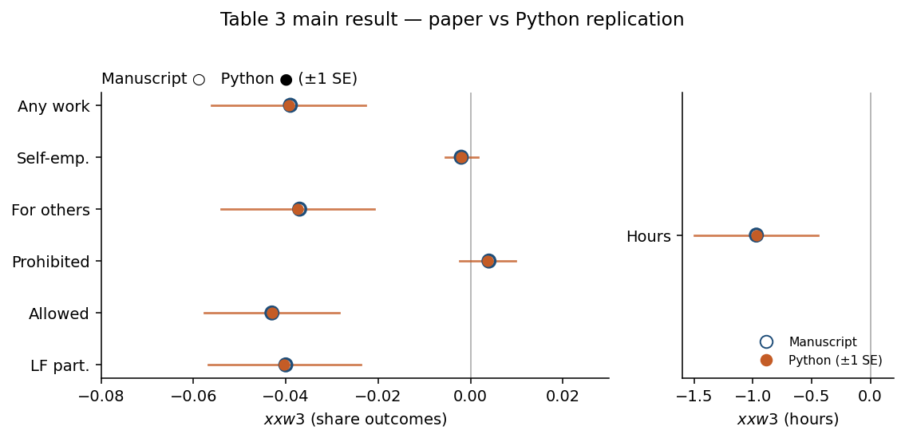

# Case study: Lakdawala et al. (2025)

**Paper:** *The Effects of Expanding Worker Rights to Children*  
Lakdawala, Martínez Heredia, Vera-Cossio — [Dataverse 10.7910/DVN/WJIQ6G](https://doi.org/10.7910/DVN/WJIQ6G)

Everything in this folder is **specific to this paper**. Shared library code lives in repo-root [`opencausallab/`](../../opencausallab/).

## For a five-minute review

Read in this order:

1. [Replication Scope](docs/replication_scope.md)  
2. [Verification Summary](docs/verification.md)  
3. [Discrepancy Appendix](docs/discrepancy_appendix.md)

## Status

| Check | Status |
|-------|--------|
| Table 3 design / N / coefs / SEs | Pass (matches manuscript; N = 11,991 Exact) |
| Tables 1–4, 6 location | Match manuscript |
| Table 5 wage | Near |
| Table 6 firm size | Open |



*Aggregate only: Post Law × 1{Age&lt;14} coefficients from committed Table 3 outputs (no microdata in the figure).*

## Known limitations

- **Table 6 firm size remains Open:** sample N matches exactly, but the constructed level and coefficient differ. This outcome is **excluded from current causal-ML extensions** so unresolved replication uncertainty does not leak into exploratory CATE work.
- **Table 5 wage** is **Near** (Python N = 715 vs manuscript 712); inference is unchanged. See the discrepancy appendix.
- Survey microdata are not redistributed; rebuild locally from Dataverse (see [REPRODUCTION.md](docs/REPRODUCTION.md)).

## Causal-ML maturity

The causal-ML module is **exploratory research code**. Its estimates are **not part of the replication claim** and should **not** be interpreted as confirmed extensions without additional validation. In particular, they are not pre-registered substantive findings; holdout / audit notes live in [`docs/Leah_replication_causal_ML_audit.md`](docs/Leah_replication_causal_ML_audit.md).

Optional install from repo root: `python -m pip install -e '.[causal-ml]'`.

## Layout

| Path | Role |
|------|------|
| `docs/` | Design, verification, discrepancies, reproduction |
| `docs/figures/` | Aggregate review figures (no person-level data) |
| `vendor/` | Authors’ `.do` files (specification only) |
| `src/` | Paper ETL + tables |
| `scripts/` | CLI entry points |
| `tests/` | Pytest validators |
| `data/` | raw / intermediate / final (microdata not in git) |

## Run

From the **repo root** (preferred):

```bash
python -m pip install -e '.[replication,dev]'
ocl study lakdawala2025 check-data
ocl study lakdawala2025 table3
ocl study lakdawala2025 verify
```

Or from this directory:

```bash
python scripts/run_table3.py
python scripts/ci_gate.py
```

## Docs

1. [DESIGN.md](docs/DESIGN.md)  
2. [replication_scope.md](docs/replication_scope.md)  
3. [verification.md](docs/verification.md)  
4. [discrepancy_appendix.md](docs/discrepancy_appendix.md)  
5. [REPRODUCTION.md](docs/REPRODUCTION.md)  
6. [stata_python_map.md](docs/stata_python_map.md) — `.do` → `.py` file map
