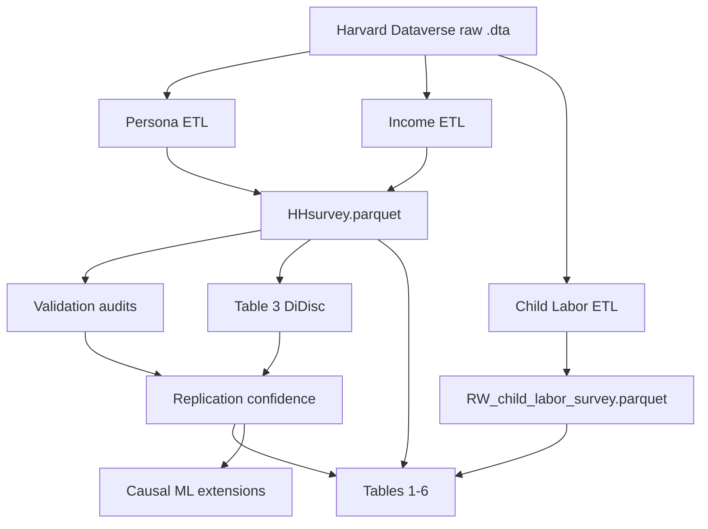

# Pipeline DAG (Lakdawala et al. case study)

```text
Harvard Dataverse (.dta)
        │
        ├──────────────────────┐
        ▼                      ▼
  Persona (2012–2019)    Income (2012–2017)
        │                      │
        ▼                      ▼
  compile + clean         compile + clean
        │                      │
        └──────────┬───────────┘
                   ▼
            travel / assets
                   │
                   ▼
             HHsurvey.parquet
                   │
                   ├─────────────┐
                   ▼             ▼
              Validation      Table 3
                   │         (DiDisc)
                   ▼             │
            Replication ←────────┘
             confidence
                   │
                   ▼
            Tables 1–6 CSV
                   │
                   ▼
         Extensions (CATE)   [after verification]
```

Child Labor Survey is a **parallel** branch → `RW_child_labor_survey.parquet` → Tables 1C / 2B / 5 CL.



See [`pipeline.md`](pipeline.md) for file-level lineage and [`SOFTWARE.md`](../../../SOFTWARE.md) for module boundaries.
